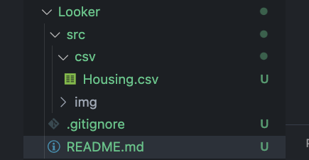

# Looker training
###### The purpose of this issue is to provide practice exercises in Looker, covering key functionalities such as adding data sources, creating blended data, and adding data from multiple sources. The trainee will practice blending data using the Austin Bikeshare Dataset (tables bikeshare_stations and bikeshare_trips) and perform other exercises using the Kaggle Housing Prices Dataset (imported as CSV). The trainee will also practice creating calculated fields, metrics, filters, visualizations, customizing dashboards, and managing permissions.
---
***1. Add Data Sources (Kaggle CSV,  BigQuery)***

* Add data from multiple sources to Looker.

**Task:**

* Download the **Kaggle Housing Prices Dataset** from ***Kaggle***.

* Upload the dataset in **CSV format** into Looker.

* Add the following data sources:

    * **CSV:** Kaggle Housing Prices dataset.

    * **BigQuery:** Use the Austin Bikeshare Dataset (bigquery-public-data: austin_bikeshare.bikeshare_stations and bikeshare_trips).

* Document the steps for connecting each data source to Looker.

    - First to all We downlad the csv file and put it in to our project folder:

    

    - To create a Datasource, select + Create and then Data source:

    

    - After that We select from wich source came the data, this time We will choose File Upload:

    

    - To finish the proces We just find our file and select Open for the upload.

     

    - Now, if We want to load a dataset from a tables in BigQuery We try the next steps:

        - We can choose our own projects just by selecting it and his dataset and his tables, but for this case We gonna choose a two tables of a public dataset in BigQuery and We get their data with a simple query:
        `Custom query->Billing Project`(here if We dont see our project, We can add it manually in the "Enter project id manually")`->Enter Custom Query`.
        And then select Connect. Example:
    
    

| **TASK**    | :white_check_mark: |
| :---        |               ---: |

---

***2. Create Blended Data (Austin Bikeshare)***

* Learn how to create blended data by combining data from the **Austin Bikeshare Dataset.**

**Task:**

* Blend the **bikeshare_stations** and **bikeshare_trips** tables from the Austin Bikeshare dataset.

* **Join type:** Use an **inner join** on the `station_id` field to blend the data between the trips and stations.

* Example: Calculate the number of trips per station, and blend this with station data such as the location (latitude, longitude).

* Use this blended data to create visualizations, such as:

    * A bar chart showing the number of trips per station.

    * A map displaying the locations of stations and the number of trips originating from each station.

* Document the process of blending the data and creating the visualizations.

    - For the blend of the tables We going to create de blend from BigQuery bringing us both tables with the requested **inner join**.

    

    - Now, to show the data, first we need to create a Report, like we create a data source but choosing the new report button.

    

    - After click in the new report button, looker will ask us the origin of our data, for this example we gonna choose BigQuery option and repeat the previous task for adding new datasource from BigQuery, all of this using the blend query we create in BigQuery:

    

    - If the project was created correctly, we can saw the button for our data at the right and clicking it will show our field for the query.

    

    - To create a chart We the trips per station, we need to add the chart to the page, in this case We will use a basic table.

    

    - Now, to show data in this table We need to drag some variables to de Dimension section (green background) and this will be the data that we want to show as it is. To form a group with another data we just drag the variable to the metric section (first blue background) and specify the function we want on that metric (sum, max, min, avg, etc.).

    

    -  For this example we just only need the name of the station and the numbre of trips starter on that station, using a metric of SUM, to apply this just click at left of the blue section where the CT is visible and then choose the right metric we want and We can change the name of the column at the first option:

    

    - To make a bar chart We just to add the chart and use the same variables for this case:

    

    - Finally for the map chart, the bikeshare dataset was not including a latitude and longitude datas, then for this case we use another public dataset: `faa.us_airports` wich We use a BigQuery to bring us all the public airpots, name and lattitude and longitude in the New York state, to show where they are and his name. (Important, to show data in a map is strongly recomended that We have to have a field with this format in the value: `POINT(-65.3038783 18.31295177)` to Looker can show it in a easier way on "geospatial field" parameter). Remeber, when we create this project We have to call our data from BigQuery and put it the query previously reviewed in BQ. 

    

| **TASK**    | :white_check_mark: |
| :---        |               ---: |

---

***3. Create Calculated Fields (Kaggle Housing Prices)***

* Create calculated fields based on the Kaggle Housing Prices Dataset.

**Task:**

* Example calculated fields:

    * **Price per square foot:** Create a calculated field that divides the `SalePrice` by the `GrLivArea` (Above ground living area).

    * **Estimated monthly mortgage:** Use a fixed interest rate and loan term to estimate the monthly mortgage payments based on `SalePrice`.

* Document the process for creating these fields and use them in visualizations.

    * For this exercise We need to use a fields that are not include in csv file, so We need to create values using others values, for that We have to choose the "+ Add field" at the bottom of the data column then choose a "add calculated field", Next we put the name of our new data field and in the formula input We put our operation as complex as necessary, either dragging them clicling them or writing them:

    

    

    * For the Estimated monthly mortgage we solve by the same way, just creating anothers field that we can manipulated to have the values we want.

| **TASK**    | :white_check_mark: |
| :---        |               ---: |

---

***4. Create Metrics***

* Define key **metrics** using the Kaggle Housing Prices Dataset.

**Task:**

* Create metrics such as:

    * **Average home price:** Calculate the average value of SalePrice.

    * **Total number of homes sold:** Count the total entries in the dataset.

    * **Average living area:** Calculate the average of GrLivArea.

* Add these metrics to a dashboard and document their creation.

    * For this task We need to create a charts per metrics they ask of us. We gonna use the Scorecard chart. In the properties column we just add the field that we want to calculate and pick the function We need, AVG for sales and another chart with AVG too for the area, for the total of sales Looker creat by default a data with the total of rows of each dataset that We add at project named Record count.

    

| **TASK**    | :white_check_mark: |
| :---        |               ---: |

---

***5. Customize the Dashboard Canvas and Navigation***

* Customize the layout and appearance of the dashboard.

**Task:**

* Organize charts, tables, and visual elements on the dashboard for clarity.

* Add navigation buttons or filters for switching between views (e.g., by neighborhood, house style).

* Document the customization process and the design choices.

    - We create this look up, adding a logo, rectangles, scorecard, buttons, a table and a pie chart:

    

    - For a estetic elements We just need to select them in just at the right of the `Add a control` button: this elements just need very few configs like, width, height, color, text or in the case of images, the url or path to the file, be careful with the positioning of the layout, example, images and text need to be up rectangles or some stetic element to be displaying more eficient.

    

    - Next, to add some filters to our data tables we need to create an `Add a control` and then `Drop-down list`:

    

    - For this element We need just to add the field that we want to be flitered in  the property of `Control Field`, the rest are options like range, order and style effects.

    

    - For an extra tip, we can group elements to be or not affected by the filteres, for default the filters will apply to al elementes in the sheet, to group elements just drag the cursor and select all elemente Ypu want and the right click over one of them and select `Group`, in thes case the scorecard with the total of personal dont be afected by any of the filters in the sheet.

    

| **TASK**    | :white_check_mark: |
| :---        |               ---: |

---

***6. Use Custom Filters***
* Apply custom filters to the Kaggle Housing Prices Dataset and the blended Austin Bikeshare data.

**Task:**

* Add filters such as:

    * **Price range:** Allow users to filter by home price (SalePrice).

    * **Living area range:** Filter homes by GrLivArea (above ground living area).

    * **Station name:** Filter by station from the Austin Bikeshare data.

    * **Trip duration:** Filter bikeshare trips by duration (duration_minutes).

* Demonstrate the use of these filters in dashboards and reports.

    - For this task we make a `Input box` for a specific area or greater than and `Slider` for a price range controls, and is to easy like just adding a simple variable to each filter that We want to show. This for the **Housing Prices Dataset.**

    

    - In the case for the `Bikeshare Station names` and `trip duration` the dataset doesnt provide the finish trip date, instead its bring us a `duration_time` data, already in minutes for this task, so the creation of this data would already be implicit in the table.

    

| **TASK**    | :white_check_mark: |
| :---        |               ---: |

---

***7. Use Parameters for Data***
* Use parameters in Looker to control data dynamically.

**Task:**

* Create parameters for:

    * Selecting a **time range** (e.g., filter homes sold within a certain period or bikeshare trips within a date range).

    * Choosing a **data source** (e.g., switch between housing dataset and bikeshare data).

* Document the process and how the parameters adjust the displayed data.

    - To select a range of dates on a chart, We need the control `Date range control`, then put the date value in the chart to be enabled the control
        >* **Date range dimension** this field will be the value for the control range
        >* **Dimension** this field will the axis x
        >* **Metric** for this the metric will be applied to the dimension

    

    - To choose between datasets in a project We can add a multiples dataset, wwith this action We can put diverse info in a multiples charts in one porject. In the squere We can see that are multiples datasets, each with a bunch of info not realted between they.

    

| **TASK**    | :white_check_mark: |
| :---        |               ---: |

---

***8. Add Charts, Tables, and Configure Dimensions and Appearance***
* Add visual elements such as charts and tables to present the data.***

**Task:**

* Add visualizations such as:

    * **Bar chart:** Show the average home prices by Neighborhood from the Kaggle dataset.

    * **Line chart:** Display the number of bikeshare trips over time in Austin.

    * **Table:** List properties with their price, square footage, and the estimated monthly mortgage.

* Configure dimensions, filters, and appearance to enhance readability and visual appeal.

* Document the configuration and choices made for each visualization.

    - For the fist task we agregate a bar chart in the dimension value add the number of bathroms instead of neighborhood, due to the missing neighborhood column and in the metric we put de price value with an AVG filter and in each bar We can see the AVG of all houses per number of bathrooms.

    

    - For the secodn task we add `Time series` chart, and a `Date range control`, for this implementation We need to have a date type value in our dataset and put it in the `Date range dimension` property, the rest we just add a range in the control an in the charte We use the date value and a metric We want, in this case We use the default row counts value.

    

    - For the third task we gonna re use the previous mortage report with interest by year. Remenbered that we can add only dimension or dimensions + metrics and We can create fields based in others appliying operations or a bunch of methods as We need, the values of interests and year-interest was created via Looker and not bringing with the BigQuery query connection.

    

    **Only for the point 8 We not adding stetic layouts**

| **TASK**    | :white_check_mark: |
| :---        |               ---: |

---

***9. Manage Permissions for Sharing Dashboards and Setting Roles***
* Set up permissions for sharing the dashboard and assigning roles.

**Task:**

* Share the dashboard with specific users or groups (e.g., team members).

* Assign roles such as **Viewer** or **Editor** to control what users can see and modify.

* Document the process of configuring permissions and roles.

    - To share the document with other people we click in the `Share` button behind the `View` blue button and add the people to share the report or We can share with a whole spacework members. At the same members pop up, We found at the right a drop menu with viewer or editor permissions.

    

    

| **TASK**    | :white_check_mark: |
| :---        |               ---: |

---